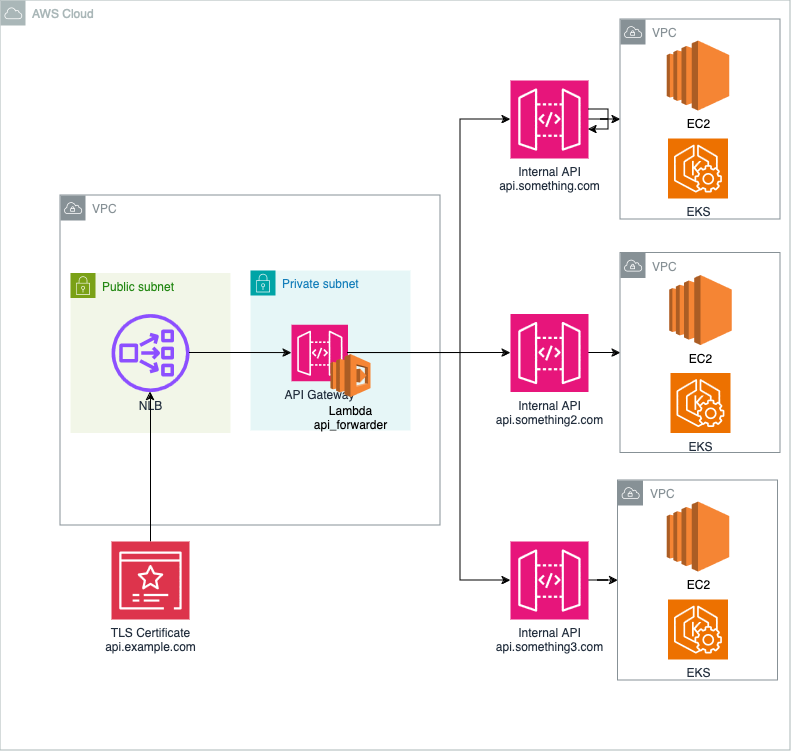

# API Forwarder

La idea principal es poder hacer un forwarding de una API a otra.

## API Gateway

Por que usar el API Gateway de AWS

1. Control de tráfico: API Gateway permite definir límites de tasa para controlar la cantidad de solicitudes que los clientes pueden hacer a tu API en un período de tiempo específico. Esto ayuda a prevenir sobrecargas y proteger tu backend de posibles abusos o ataques.
2. Facilidad de configuración: Puedes establecer límites de tasa a nivel global, por método de API, o incluso a nivel de cliente usando planes de uso. Esto te brinda flexibilidad para gestionar el tráfico de manera granular.
3. Seguridad y protección: Al limitar la tasa de solicitudes, puedes mitigar ataques de denegación de servicio (DoS) y otros tipos de abuso que puedan comprometer la disponibilidad y el rendimiento de tu API.
4. Métricas y monitoreo: AWS API Gateway proporciona herramientas integradas de monitoreo y métricas a través de Amazon CloudWatch. Puedes rastrear las tasas de solicitudes, respuestas y errores para obtener una visión clara del uso y rendimiento de tu API.
5. Integración con otros servicios de AWS
6. Escalabilidad: API Gateway maneja automáticamente la escalabilidad, permitiendo que tu API soporte grandes volúmenes de tráfico sin necesidad de configuraciones complejas o gestión de infraestructura adicional.

Mas informacion:
  - https://docs.aws.amazon.com/apigateway/latest/developerguide/api-gateway-request-throttling.html
  - https://docs.aws.amazon.com/apigateway/latest/developerguide/http-api-throttling.html

## API forwarder

El api_forwarder se utilizaria dentro de una lambda en el API Gateway para poder distribuir los requests.

Para poder usar el codigo hay que hacer lo siguiente:

1. Importar las librerias necesarias: Flask para poder crear la API y Requests para poder hacer el forwarding
2. Definir un diccionario de mapeos (API_MAPPING) para poder forwardear el path con su correspondiente API
3. We create a route that catches all paths using '/<path:subpath>'.
4. In the forward_request function:

    - Extraemos el destino.
    - Verificamos que el destino sea valido
    - Construimos la nueva URL
    - Hacemos el forwarding preservando el metodo, headers, data y cookies
    - Devolvemos la respuesta de la API de destino

Para poder usar la API hay que hacer lo siguiente:

1. Instalar los paquetes necesarios: pip install flask requests
2. Correr el script: python api_forwarder.py

La API va a estar funcionando en http://localhost:5000.

Mas information: https://docs.python-guide.org/dev/virtualenvs/#virtualenvironments-ref

Ejemplos de referencia:
  - https://auth0.com/blog/developing-restful-apis-with-python-and-flask/
  - https://www.moesif.com/blog/technical/api-development/Building-RESTful-API-with-Flask/